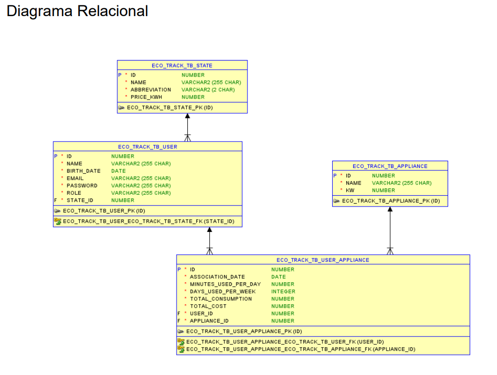

# Eco Track

### Link p/ apresentação da solução: https://www.youtube.com/watch?v=tvKSlDiB8sQ

### Link demonstrando o software funcionando: https://www.youtube.com/watch?v=FKvtZzVmhJ4

## Integrantes do Grupo

### Kauã Almeida Silveira - RM 552618 
### Rafael Vida - RM 553721 
### Gustavo Maia - RM 553270 

## Instruções para Rodar a Aplicação na Nuvem Azure

- Ip da maquina virtual: 191.232.39.193
- Porta da aplicação: 8080
- User: admlnx
- Senha: Fiap2tdsps@2024

## Instruções para Rodar a Aplicação LOCAL

## Pré-requisitos para rodar a API Spring Boot:
- Java 17 ou superior instalado (para a API Spring Boot)
- Maven instalado (para a API Spring Boot)
- As configurações do banco de dados Oracle estão no arquivo `application.properties` na pasta `src/main/resources`,
  não é necessário instalar o banco de dados Oracle, pois a aplicação está utilizando um banco de dados disponibilizado
  em um servidor remoto da FIAP.

## Passo a Passo:

1. **Clone o repositório:**
   ```git clone https://github.com/GlobalEcoTrack/javaAdvanced```
2. **Acesse a pasta do projeto no intellij:**
3. **Defina o JDK no Intellij para Run & build do projeto**
4. **Rode a aplicação Spring Boot, localizada na pasta raiz**
   ```ApiGsEcoTrackApplication.java```

## Como testar a API Spring Boot:

1. **Importe o arquivo de coleção do Postman:**
   ```EcoTrackGS.postman_collection.json```
2. **Importe o arquivo de ambiente do Postman:**
   ```Auth.postman_environment.json```
3. **Execute as requisições do Postman para testar a API**

## Endpoints da API Spring Boot:

Observação: Vale ressaltar que a API Spring Boot está utilizando
Spring Security com JWT para autenticação e autorização. Logo, é necessário
realizar o login para obter o token JWT e inseri-lo no Authorization das requisições, de todos recursos, como bearer token.

### Autenticação (`/auth`)
- **POST** `/auth/login`  
  **Descrição:** Realiza login e retorna um token de autenticação.
  ```json
  {
    "email": "kaua.silveira@gmail.com",
    "password": "kaua2011"
  }
  
- **POST** `/auth/signup`  
  **Descrição:** Cria uma nova conta para um usuário.
  ```json
  {
    "name":"kaua",
    "birthDate":"2024-11-15",
    "abbreviationState": "SP",
    "email":"kaua@gmail.com",
    "password":"123"
  }
  ```

### State (`/state`)
- **GET** `/state`

    **Descrição:** Retorna a lista de estados.

- **GET** `/state/pageable?page=2&size=5`

    **Descrição:** Retorna a lista de estados de forma *PAGINADA*.

- **POST** `/state`

    **Descrição:** Insere um novo state.
    ```json
    {
    "name":"teste",
    "abbreviation":"T",
    "price_kwh":1.02
    }

- **DELETE** `/state/{id}`

    **Descrição:** Deleta um state.
  
- **PUT** `/state/{id}`

    **Descrição:** Atualiza um state.
    ```json
    {
    "name":"testao",
    "abbreviation":"T",
    "price_kwh":1.02
    }

### Appliance (`/appliance`)
- **GET** `/appliance`

    **Descrição:** Retorna a lista de appliance.

- **POST** `/appliance`

    **Descrição:** Insere um novo appliance.
    ```json
    {
    "name":"Teste",
    "kw":0.5
    }

- **DELETE** `/appliance/{id}`

    **Descrição:** Deleta um appliance.
  
- **PUT** `/appliance/{id}`

    **Descrição:** Atualiza um appliance.
    ```json
    {
    "name":"Testao",
    "kw":0.5
    }
  
### UserAppliance (`/userAppliance`)
- **GET** `/userAppliance`

    **Descrição:** Retorna a lista de userAppliance.

- **POST** `/userAppliance`

    **Descrição:** Insere um novo userAppliance.
    ```json
    {
    "appliance_id": 3,
    "minutesUsedPerDay": 1440,
    "daysUsedPerWeek":7
    }

- **DELETE** `/userAppliance/{id}`

    **Descrição:** Deleta um userAppliance.
  
- **GET** `/userAppliance/report`

    **Descrição:** Retorna o relatório dos eletrodomesticos e seus consumos.

- **GET** `/userAppliance/report/monthYear`

    **Descrição:** Retorna o relatório dos eletrodomesticos e seus consumos por mês e ano.


## Diagrama de Entidade-Relacionamento (DER)


